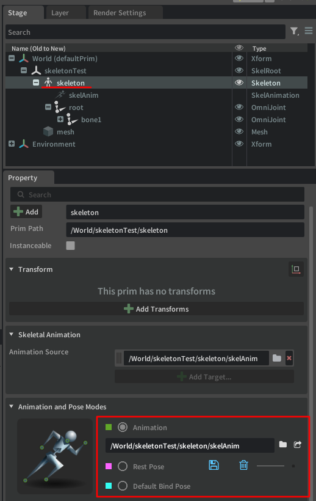

# SkelAnimationでポーズを与える

参考のソースコード : [SkeletonSkinPose.py](./SkeletonSkinPose.py)

「[スケルトンの構造とスキン](./SkeletonSkin.md)」の続きです。  

このサンプルソースコードでは、"createMeshWithSkeletonSkin"でSkeletonとSkinを作成するまでは「[SkeletonSkin](./SkeletonSkin.py)」と同じ内容です。   
その後でSkelAnimationを作成してポーズを与えています。  

## SkelAnimationの作成

Skeleton構造にポーズを与えたりアニメーションを与えるには"SkelAnimation"を使用します。  

  

"SkelAnimation"はSkeletonの子のprimとして配置します。  
アニメーションを行うツールではこれを「AnimationClip」と呼ぶことが多いですが、それと同じ存在です。  
ここにアニメーションの要素が格納されることになります。 
USDでは以下のような構造になります。   
```  
SkelRoot
  Skeleton
    SkelAnimation
  mesh
```  

また、SkelAnimationに[TimeCode](./UsdTimeCode.md)を指定しない場合はポーズとして作用します。  
Pythonでは以下のようにSkelAnimationを作成し、Skeletonにバインドします。  

```python
def createSkelAnimation(skeletonPrimPath : str):
    skeletonPrim = stage.GetPrimAtPath(skeletonPrimPath)
    if not skeletonPrim.IsValid():
        return

    # Get or Create SkelAnim.
    primPath = f"{skeletonPrimPath}/skelAnim"
    skelAnim = stage.GetPrimAtPath(primPath)
    if not skelAnim.IsValid():
        skelAnim = UsdSkel.Animation.Define(stage, primPath)
    else:
        skelAnim = UsdSkel.Animation(skelAnim)
    
    # Set SkelAnim.
    UsdSkel.BindingAPI(skeletonPrim).CreateAnimationSourceRel().SetTargets([skelAnim.GetPath()])
    UsdSkel.BindingAPI.Apply(skeletonPrim)

    return skelAnim
```

UsdSkel.AnimationでSkelAnimationを新規作成(Define)、すでに存在する場合は"UsdSkel.Animation(prim)"として取得します。  
また"UsdSkel.BindingAPI"を使用してSkeletonからskelAnimationを関連付けています。  

SkelAnimationは作成した直後は何の情報もありません。  

## SkelAnimationに格納できる要素

|要素名|型名|内容|   
|---|---|---|   
|Joints|token[]|ジョイント名の配列|   
|Translations|Gf.Vec3f[]|Translationの配列|   
|Rotations|Gf.Quatf[]|Rotationの配列|   
|Scales|Gf.Vec3f[]|Scaleの配列|   

tokenはstringに相当します。  
4x4Matrix(Gf.Matrix4d)も格納できますが動きとして安定しないため(Translation, Rotation, Scaleが合わさっているためにそのままキーフレーム補間しても破綻しやすい)省きました。  

別途、BlendShapeもSkelAnimationに格納することができます。  
TODO : これは別途で説明します。  

|要素名|型名|内容|   
|---|---|---|   
|BlendShapes|token[]|BlendShape名の配列|   
|BlendShapeWeights|float[]|BlendShapeのウエイト値の配列|   

## SkelAnimationに情報を格納

SkelAnimationにJoint名の配列、移動/回転/スケールを与えます。  
次のようにbone1，bone2に回転を与えることで変形させています。   
最終的にはジョイントを使って以下のような変形を行うことになります。  
 

オイラーの回転角（RotationXYZ）とQuaternion (XYZW要素を持つ)の相互変換はよく使うため、ここで紹介しておきます。  

### QuatFからRotationXYZに変換

```python
def convertQuatFToRotationXYZ(quat):
    rV = Gf.Rotation(quat).Decompose(Gf.Vec3d(0, 0, 1), Gf.Vec3d(0, 1, 0), Gf.Vec3d(1, 0, 0))
    rV = Gf.Vec3d(rV[2], rV[1], rV[0])
    return rV
```

### RotationXYZからQuatFに変換

```python
def convertRotationXYZToQuatF(rotXYZ : Gf.Vec3f):
    rotX = Gf.Rotation(Gf.Vec3d(1, 0, 0), rotXYZ[0])
    rotY = Gf.Rotation(Gf.Vec3d(0, 1, 0), rotXYZ[1])
    rotZ = Gf.Rotation(Gf.Vec3d(0, 0, 1), rotXYZ[2])
    rotXYZ = rotX * rotY * rotZ
    q = rotXYZ.GetQuat()
    return Gf.Quatf(q)
```

### デフォルト値をSkeletonから持ってくる

ジョイント名の配列、移動/回転/スケールの配列はSkeletonにすでに格納済みですので、これをSkelAnimationに持っていきます。  

skeletonPrimPathにスケルトンのPrimパスが入っている場合は、以下でスケルトンを取得。  
```python
# Get Skeleton.
skeletonPrim = stage.GetPrimAtPath(skeletonPrimPath)
skeleton = UsdSkel.Skeleton(skeletonPrim)
```
また、skelAnimがUsdSkel.Animationであるとします。  

ジョイント名のリストは以下の様に取得できます。  
```python
jointNamesList = skeleton.GetJointsAttr().Get()
```
これはstring型の配列で、以下の様に値が入っています。   
```
["root", "root/bone1", "root/bone1/bone2", "root/bone1/bone2/bone3", "root/bone1/bone2/bone3/bone4"]
```

このジョイントごとに移動/回転/スケールも与えることになります。  
なお、SkelAnimationには移動/回転/スケールそれぞれを同じ要素数だけ与える必要がある点に注意する必要があります。  
スケールはすべて(1, 1, 1)なので省略する、ということはできません。  

同様に、移動/回転/スケールのジョイントごとの配列をSkeletonから取得します。  
RestTransformで取得した配列を移動/回転/スケールに分解して取得しました。  
このとき、移動はGf.Vec3f、回転はGf.Quatf、スケールはGf.Vec3fとしています。  
```python
translationList = []
rotationList = []
scaleList = []
restTransforms = skeleton.GetRestTransformsAttr().Get()
for m in restTransforms:
    # Decompose Transform into Translate, Rotate, and Scale.
    translation, rotation, scale = UsdSkel.DecomposeTransform(m)

    translationList.append(Gf.Vec3f(translation))
    rotationList.append(Gf.Quatf(rotation))
    scaleList.append(Gf.Vec3f(scale))
```

### 回転値を変更

"root/bone1"（配列の1番目）と"root/bone1/bone2"（配列の2番目）の回転値を変更します。  
convertRotationXYZToQuatFは前述したオイラー角のXYZをQuatFに変換するメソッドです。  
```python
rotationList[1] = convertRotationXYZToQuatF(Gf.Vec3f(-30.0, 0.0, 0.0))
rotationList[2] = convertRotationXYZToQuatF(Gf.Vec3f(-20.0, 0.0, 0.0))
```

### SkelAnimationに値を格納

ジョイント名のリストを格納。  

```python
jointsAttr = skelAnim.CreateJointsAttr()
jointsAttr.Set(jointNamesList)
```

移動/回転/スケールを格納する前にキャッシュをクリアします。  
これを呼ばないと古いジョイント情報が残ったままになり変更が効かない、となることがあります。  

```python
# Clear cache.
xformCache = UsdGeom.XformCache()
xformCache.Clear()
```

移動/回転/スケールの配列を指定します。  

```python
attr = skelAnim.CreateTranslationsAttr()
attr.Set(translationList)

attr = skelAnim.CreateRotationsAttr()
attr.Set(rotationList)

attr = skelAnim.CreateScalesAttr()
attr.Set(scaleList)
```

これで、「アニメーションしないときの姿勢」をSkelAnimationに格納することができました。  
usdaでSkelAnimationを見ると以下のようになりました。  

```
def SkelAnimation "skelAnim"
{
    uniform token[] joints = ["root", "root/bone1", "root/bone1/bone2", "root/bone1/bone2/bone3", "root/bone1/bone2/bone3/bone4"]
    quatf[] rotations = [(1, 0, 0, 0), (0.9659258, -0.25881904, 0, 0), (0.9848077, -0.17364818, 0, 0), (1, 0, 0, 0), (1, 0, 0, 0)]
    half3[] scales = [(1, 1, 1), (1, 1, 1), (1, 1, 1), (1, 1, 1), (1, 1, 1)]
    float3[] translations = [(0, 0, 0), (0, 25, 0), (0, 25, 0), (0, 25, 0), (0, 25, 0)]
}
```

## USD Composerでジョイントの反映を切り替える

SkeletonではBindTransformとRestTransformを持ち、これはデフォルトの姿勢になります。  
加えて、Skeletonから参照されたSkelAnimationの姿勢があります。  
これはSkeletonを選択したときのPropertyで"Animation and Pose Modes"から切り替えることができます。  
  

TODO : アニメーションのためのキーフレームは別ページに書きます。  

