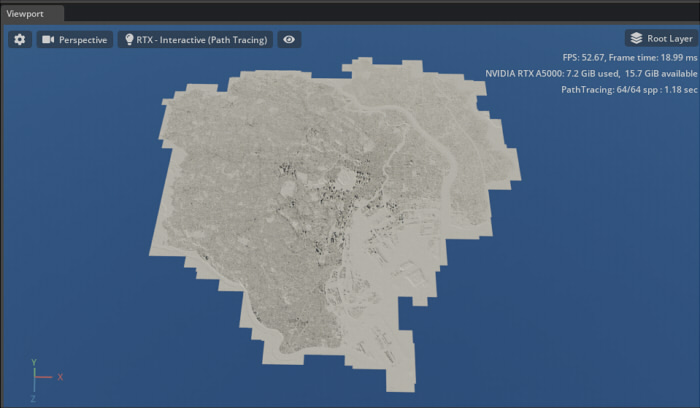
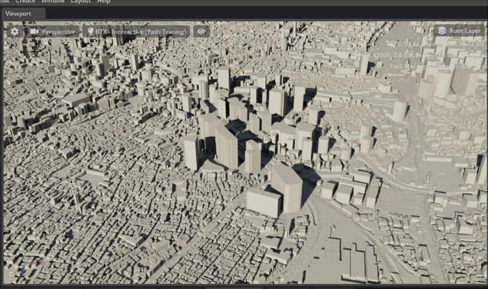
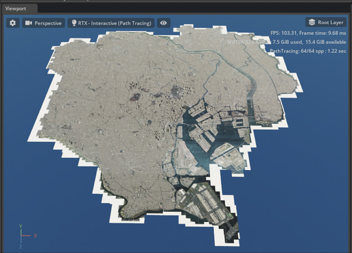
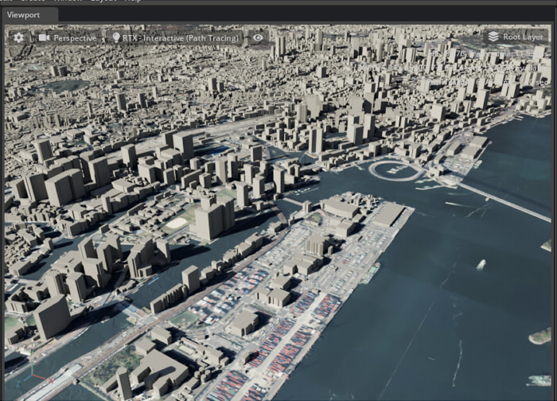
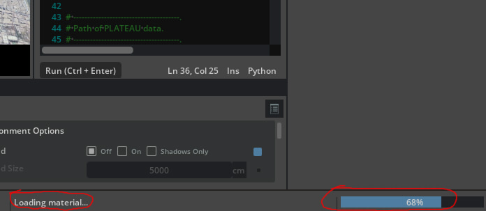
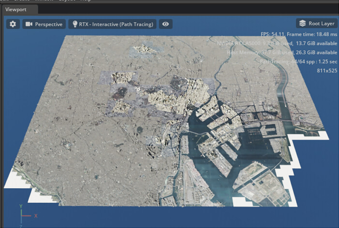

# PLATEAU

Project PLATEAU ( https://www.mlit.go.jp/plateau/ )の都市データをOmniverseにインポートします。      

G空間情報センターの「3D都市モデルポータルサイト」( https://www.geospatial.jp/ckan/dataset/plateau )の「東京都23区」より、     
OBJ形式のデータを使用しています。      

また、地形のテクスチャについてはGeoTIFFを分割して使用しました。     

## 使い方

### 「東京都23区」のobjファイル一式をダウンロード

「3D都市モデルポータルサイト」より、「東京都23区」のobjファイル一式をダウンロードします。     
https://www.geospatial.jp/ckan/dataset/plateau-tokyo23ku/resource/9c8d65f1-a424-4189-92c0-d9e3f7c3d2db

「13100_tokyo23-ku_2020_obj_3_op.zip」がダウンロードされますので解凍します。      

注意 : 日本語フォルダ名がない場所に展開したファイルを配置するようにしてください。     


### 「東京都23区」のGeoTIFFファイル一式をダウンロード

また、地形のテクスチャで「東京都23区」の「GeoTIFF」のオルソ画像データを用います。     
これは航空写真を平行投影として構築範囲(533926、533935など)ごとにテクスチャ化したものです。     
以下より、GeoTIFFの画像をダウンロードします。      
https://www.geospatial.jp/ckan/dataset/plateau-tokyo23ku/resource/2434d5b4-7dad-4286-8da5-276f68a23797

「13100_tokyo23-ku_2020_ortho_2_op.zip」がダウンロードされますので解凍します。      

### GeoTIFF画像を10x10分割してjpeg形式に変換

Omniverseでは、tiff画像を扱うことができません。     
そのためjpegに変換するようにしました。      
また、8K解像度以上のテクスチャは読み込みに失敗するようです。     
そのため、このtiffを10x10分割しそれぞれをjpegに変換します。      

この処理はOmniverse上で行うことにしました。      
Omniverse Createを起動します。       
Omniverse Create 2022.1.2で確認しました。    

[divide_GeoTiff_images.py](./divide_GeoTiff_images.py) のスクリプトの内容を、OmniverseのScript Editorにコピーします。     

「in_plateau_obj_path」のパスに、「13100_tokyo23-ku_2020_ortho_2_op.zip」を解凍して展開されたフォルダのルートを指定します。      
「in_save_folder_path」にそれぞれのtiff画像を10x10分割したときの画像を格納するフォルダを指定します。      

スクリプトを実行します。     
この処理は時間がかかります。Consoleに"Save success !!"と出ると出力完了です。     
「in_save_folder_path」に指定したフォルダに53392500.jpg/53392501.jpgなどが出力されていることを確認します。      
このTiffからjpeg出力を行う処理は1回だけ行えばOKです。       

注意 : 日本語フォルダ名がない場所に出力したファイルを配置するようにしてください。     


### 例1 : 東京23区の地形と建物(LOD1)を読み込み

※ テクスチャは反映しません。     

 
Omniverse Createを起動し、新規Stageを作成します。     

「[import_PLATEAU_tokyo23ku_obj.py](./import_PLATEAU_tokyo23ku_obj.py)」の内容をScript Editorにコピーします。     

スクリプト上の 「in_plateau_obj_path」のパス指定を、ローカルの「13100_tokyo23-ku_2020_obj_3_op.zip」を解凍したフォルダに変更します。      

スクリプト上の 「in_assign_dem_texture」をFalseにします。     
これにより、demにマッピングするテクスチャは読み込まれません。     

スクリプトを実行します。     
この処理は時間がかかります。数分ほど待つと、StageにPLATEAUの都市データが読み込まれます。     

以下は背景のEnvironmentを指定し、RTX-Interactive (Path Tracing)にしています。     
     
    

このLOD1のみの都市データは、Omniverse Createで約12GBくらいのメモリを消費します。      
OSのメモリは32GBあれば足ります。     

### 例2 : 東京23区の地形と建物(LOD1)を読み込み + 地形のテクスチャを反映

Omniverse Create 2022.1.2で確認しました。    
Omniverse Createで新規Stageを作成します。     

「[import_PLATEAU_tokyo23ku_obj.py](./import_PLATEAU_tokyo23ku_obj.py)」の内容をScript Editorにコピーします。     

スクリプト上の 「in_plateau_obj_path」のパス指定を、ローカルの「13100_tokyo23-ku_2020_obj_3_op.zip」を解凍したフォルダに変更します。      
スクリプト上の 「in_dem_textures_path」のパスは、ローカルのGeoTiffからjpeg変換したときの出力先を指定します。     

スクリプト上の 「in_assign_dem_texture」がTrueになっているのを確認します。     
これにより、「in_dem_textures_path」で指定したフォルダからテクスチャが読み込まれ、マテリアルとテクスチャが地形のMeshであるdemに割り当てられます。     

スクリプトを実行します。     
この処理は時間がかかります。数分ほど待つと、StageにPLATEAUの都市データが読み込まれます。     
地形にはテクスチャが割り当てられています。       

以下は背景のEnvironmentを指定し、RTX-Interactive (Path Tracing)にしています。     
     
    

このLOD1のみの都市データは、Omniverse Createで約13GBくらいのメモリを消費します。      
OSのメモリは32GBあれば足ります。     

### 例3 : 東京23区の地形と建物(LOD1またはLOD2)を読み込み + 地形のテクスチャを反映

LOD2の建物がある場合はそれを読み込みます。      

Omniverse Create 2022.1.2で確認しました。    
Omniverse Createで新規Stageを作成します。     

「[import_PLATEAU_tokyo23ku_obj.py](./import_PLATEAU_tokyo23ku_obj.py)」の内容をScript Editorにコピーします。     

スクリプト上の 「in_plateau_obj_path」のパス指定を、ローカルの「13100_tokyo23-ku_2020_obj_3_op.zip」を解凍したフォルダに変更します。      
スクリプト上の 「in_dem_textures_path」のパスは、ローカルのGeoTiffからjpeg変換したときの出力先を指定します。     

スクリプト上の 「in_assign_dem_texture」がTrueになっているのを確認します。     
これにより、「in_dem_textures_path」で指定したフォルダからテクスチャが読み込まれ、マテリアルとテクスチャが地形のMeshであるdemに割り当てられます。     

スクリプト上の「in_load_lod2」をTrueに変更します。     
これにより、もし建物にLOD2の情報を持つ場合はそれが読み込まれます。     
※ LOD2はテクスチャを伴います。これにより、読み込み速度とメモリはかなり消費します。     

また、スクリプト上の「mapIndexList」に構築範囲の番号を配列で入れています。      
デフォルトでは東京23区全体をいれていますが、メモリに合わせて構築範囲の番号を調整します。     
ここでは以下のように変更しました。      
```
mapIndexList = [533945, 533946]
```

スクリプトを実行します。     
LOD2を読み込む場合は時間がかなりかかります。     
20分ほどで読み込みが完了しました。     
「mapIndexList = [533945, 533946]」でOmniverse Createで約11GBくらいのメモリを消費。      

続いて    
```
mapIndexList = [533935, 533936]
```
として追加でスクリプトを実行し、地形データを読み込みました。      
30分ほどで読み込みが完了しました。     
追加の「mapIndexList = [533935, 533936]」でOmniverse Createで合計約20GBくらいのメモリを消費。      

スクリプトで連続して複数の構築範囲を読み込む場合、読み込み完了後にフリーズする場合がありました（マテリアルの更新でぶつかる？）。     
Omniverse CreateのステータスバーでLoading Materialと出てプログレスバーのパーセントが進まない場合がありました。        
    
これを回避するため、読み込みが完全に完了するのを待って何回かに分けてスクリプトを複数回実行するようにしています。      


以下は背景のEnvironmentを指定し、RTX-Interactive (Path Tracing)にしています。     
    
    


LOD2も考慮した[533945, 533946, 533935, 533936]の構築範囲都市データは、Omniverse Createで合計で約20GBくらいのメモリを消費します。      
OSのメモリは32GBでは読み込めませんでした。64GBくらい余裕を持たせたほうがよさそうです。     

----

## ファイル

|ファイル|説明|     
|---|---|     
|[divide_GeoTiff_images.py](./divide_GeoTiff_images.py)|東京23区のPLATEAUのGeoTIFFファイルを10x10分割して、jpeg形式で指定のフォルダに出力します。<br>コード内の「in_xxx」の指定を環境に合わせて書き換えるようにしてください。|
|[import_PLATEAU_tokyo23ku_obj.py](./import_PLATEAU_tokyo23ku_obj.py)|東京23区のPLATEAUのobjファイルより、都市モデルをOmniverseにインポートします。<br>コード内の「in_xxx」の指定を環境に合わせて書き換えるようにしてください。|


