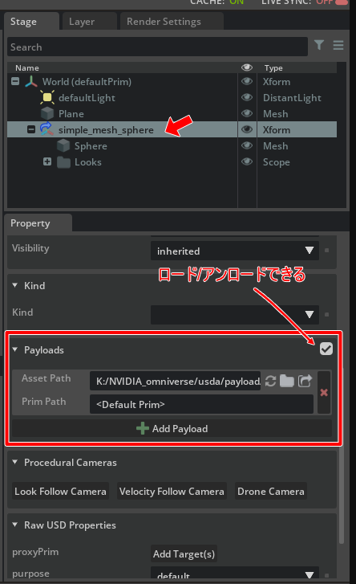
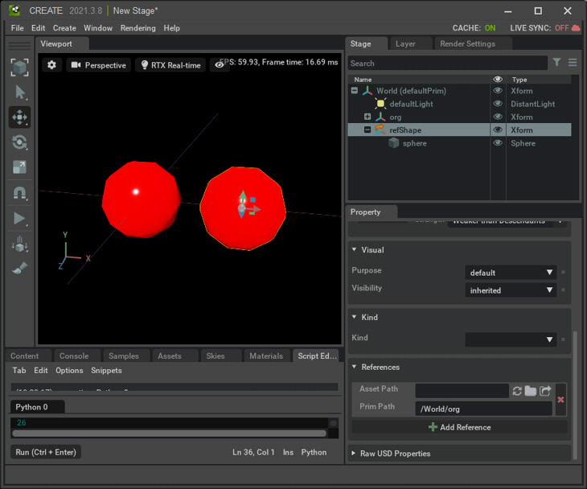

# Reference

参照の処理を行います。     

## ReferenceとPayload

USDでは、他のUSDを参照する構造として"Reference"と"Payload"があります。      
Payload は「弱い参照」となります。      
Payload としてインポートした場合は、見た目上は参照と変わりません。    
以下はOmniverse Createでのパラメータです(USD自身がこの構造を持っています)。      
    
Payload したUSDはアンロードすることができ、これによりメモリ解放できます。     
また、必要な時にロードできます。      

対してReferenceの場合は参照のロード/アンロード機能はありません。     
Payloadのほうが利便性があるため、基本的にはPayloadで参照を指定するほうがよいかもしれません。      

## サンプル

|ファイル|説明|    
|---|---|    
|[ReferenceTest.py](./ReferenceTest.py)|作成したXformに対して外部のusdファイルを参照として追加。 このサンプルでは、"ft-lab.github.io/usd/omniverse" 内を参照しています。 適宜「[sphere.usda](./usd/sphere.usda)」を相対パスとして検索できる位置に配置して試すようにしてください。 |    
|[PayloadTest.py](./PayloadTest.py)|作成したXformに対して外部のusdファイルを参照(Payload)として追加。 このサンプルでは、"ft-lab.github.io/usd/omniverse" 内を参照しています。 適宜「[sphere.usda](./usd/sphere.usda)」を相対パスとして検索できる位置に配置して試すようにしてください。 |    
|[ReferenceTest2.py](./ReferenceTest2.py)|作成したXformに対して外部のテクスチャ付きのusdファイルを参照として追加。 このサンプルでは、"ft-lab.github.io/usd/omniverse" 内を参照しています。 適宜「[./cyawan/cyawan.usdc](./usd/cyawan/cyawan.usdc)」を相対パスとして検索できる位置に配置して試すようにしてください。 |    
|[InternalReferenceTest.py](./InternalReferenceTest.py)|作成したXformに対して同一Stage内のPrimを参照として追加 |    
|[HasReference.py](./HasReference.py)|選択した形状が参照を持つかチェック|
|[HasPayload.py](./HasPayload.py)|選択した形状がPayloadを持つかチェック|
|[GetReferencePayload.py](./GetReferencePayload.py)|選択した形状がReferenceまたはPayloadの場合に、参照先のパスを取得|

----

