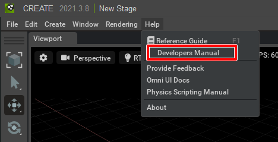
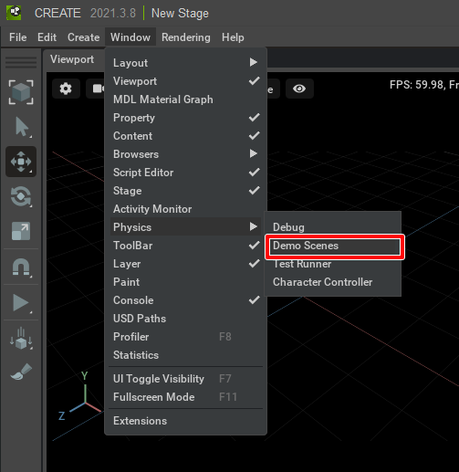
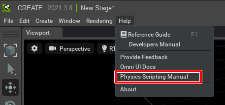

# Omniverseのスクリプトの学習手順

Omniverseのスクリプトでは、大きく3つのアクセス先があるように思います。      

* Pythonの既存モジュール (numpy/scipy/PILなど)
* USDへのアクセス
* Omniverseへのアクセス

## Pythonの既存モジュール

「Pythonの既存モジュール」は、一般的なPythonで追加できるモジュールです。      
Omniverseでは「[omni.kit.pip_archive](../pip_archive/readme.md)」のExtensionとしてまとまっています。     
これらは
```python
import numpy

v1 = numpy.array([0.0, 1.0, 2.0])
v2 = numpy.array([1.2, 1.5, 2.3])

v3 = v1 + v2
print(v3)
```
のように一般的なPythonのプログラムと同じように使用できます。    

## USDへのアクセス

Omniverseは、データ構造として「USD」( https://graphics.pixar.com/usd/release/index.html )を採用しています。      
Omniverseでも、USD SDKのPython使用時と同じように「from pxr import Usd, UsdGeom, UsdPhysics, UsdShade, Sdf, Gf, Tf」としてインポートして使用します。    

```python
from pxr import Usd, UsdGeom, UsdPhysics, UsdShade, Sdf, Gf, Tf

# Get stage.
stage = omni.usd.get_context().get_stage()

# Create sphere.
pathName = '/World/sphere'
sphereGeom = UsdGeom.Sphere.Define(stage, pathName)

# Set radius.
sphereGeom.CreateRadiusAttr(5.0)
```

上記の場合は「omni.usd.get_context().get_stage()」は、「OmniverseからStage情報を取得」する機能となり、これはUSDではなくOmniverseへのアクセス（問い合わせ）になります。     
「UsdGeom」「UsdPhysics」「Gf」などがUSDのモジュールごとの機能です。     

どの部分がUSDでどの部分がOmniverseが提供するのものか、というのはこのモジュールの名称で判断できそうです。      

USDについては、USDのAPI Documentationですべてのメソッドが網羅されているため、ここをリファレンスにするのがよさそうです。

https://graphics.pixar.com/usd/release/api/index.html

## Omniverseへのアクセス

Omniverseへのアクセスは「omni.xxx」や「carb」として指定する部分になります。     
以下のようなものがあります。     

* カレントStageの取得 (omni.usd)
* Stageウィンドウでの選択処理 (どのPrimが選択されているか) (omni.usd)
* UIの表示 (omni.ui)
* キーボードやGamePadの入力 (carb.input)

これらのOmniverseのアクセスは"Omniverse Kit"の"Kit Programming Manual"に情報があります。    
Omniverse Createの場合は、メインメニューの[Help]-[Developers Manual]からドキュメントにアクセスできます。    
    

UIについては同じくメインメニューの[Help]-[Omni UI Docs]からアクセスして表示されるドキュメントが参考になります。     

## Omniverse上でのスクリプトの学習方法

Omniverseは範囲がすごく広いため、またUSD自身も情報量がすごく多いため、はじめの手ごたえをつかむのが難しいかもしれません。      

USD単体については
```python
from pxr import Usd, UsdGeom, UsdPhysics, UsdShade, Sdf, Gf, Tf

# Get stage.
stage = omni.usd.get_context().get_stage()
```
としてStageを取得した後はUSDの操作になるため、そこで試しながら追いかけるのがよさそうです。     

また、Physicsのサンプルとドキュメントはビジュアルとしての動きもあって分かりやすいため、そこから入るとスクリプトは理解しやすいかと思います。      
Physicsのデモについてはメインメニューの[Window]-[Physics]-[Demo Scenes]を選択。      
    

"Physics Demo Scenes"ウィンドウにサンプルが列挙されます。     
ソースコードも見ることができます。      
    

Physicsのドキュメントは、メインメニューの[Window]-[Physics]-[Physics Scripting Manual]を選択。      
    
このドキュメントはPhysicsに絞っているため、USDの使い方も合わせて分かりやすいと思います。     
Physics自体はOmniverseの機能というわけではなく、USDのAPIとして「UsdPhysics」でアクセスできるようになっています。     

### Extensionを読む

難易度はありますが、既存ExtensionはPythonで書かれているためそれを解読して作法を学ぶというのもよさそうです。     
"kit/exts"や"kit/extscore"にExtensionが格納されています。      


